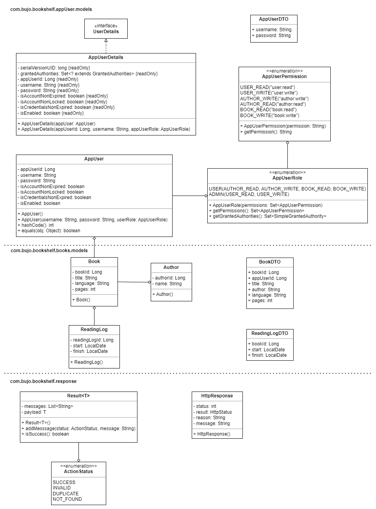

# Requirements

## Functional

- RESTful API with JWT web token authentication
  - Login/Logout and account registration
  - Username length between 3 and 100 characters
  - Password validation: 8 character length with at least one letter, one digit
    and one special character
- Add, edit and delete books
- Add and edit a book's reading activity

## Non-Functional

### User Interface

- React front-end interface
- Bootstrap/CSS module styling
- Utilize a card layout for books on bookshelf

### User Experience

- Integrate [WAI-ARIA specification](https://developer.mozilla.org/en-US/docs/Learn/Accessibility/WAI-ARIA_basics)
  to increase accessibility
  - Allows for screen reader and keyboard navigation
  - Semantic HTML elements
  - Assertive error display on forms to notify screen readers
  - Descriptions of form field requirements
- Standardize custom components such as form input, submission and button formatting

## Class Diagram

